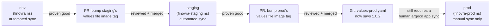

# Module 7: Environment Promotion Patterns

**Environment:** `kind` (local)
**Prerequisites:** Module 6 complete — dashboard deployed as an Argo Rollouts canary, `Synced`/`Healthy` on `1.0.2`

---

## Learning Objectives

By the end of this module, you should be able to:
- Explain why most real teams organize multiple environments with files on one branch, not one long-lived branch per environment
- Build `staging` and `prod` Helm values files on top of Finovra's existing chart, each with its own environment-specific overrides
- Set up a PR-based promotion flow, and explain the difference between the two separate gates a change passes through before it's live in prod
- Use the App-of-Apps pattern to manage multiple `Application` objects from one root, instead of `kubectl apply`-ing each by hand
- Use `sync-wave` annotations to control the order resources apply within one sync
- Explain what a `PreSync` hook is for, and why it isn't useful on every kind of sync

---

## 1. Branch-per-Environment vs. File-per-Environment

There are two common ways teams structure "one app, three environments" in a GitOps repo, and the choice shapes everything else in this module.

**Branch-per-environment:** a long-lived `dev`, `staging`, and `prod` branch, each with its own copy of the manifests. Promotion = merging `dev` → `staging` → `prod`. This looks appealing at first — it mirrors how some teams already branch application code — but it comes with real problems in practice: three branches drift out of sync with each other over time, merge conflicts show up in manifests instead of in a clean diff, and it's easy to lose track of which branch is actually "ahead." ArgoCD also has to track three separate `targetRevision`s, one per `Application`.

**File-per-environment:** one branch (`main`), with each environment as its own Helm values file — `values-dev.yaml`, `values-staging.yaml`, `values-prod.yaml` — all layered on the same shared chart. Promotion = a PR that changes one line in one values file. There's only ever one `main` to reason about, and a promotion PR's diff shows you *exactly* what's about to change in that environment — nothing more.

| | Branch-per-environment | File-per-environment |
|---|---|---|
| Number of long-lived branches | 3+ | 1 (`main`) |
| Promotion mechanism | Merge one branch into another | PR that edits one values file |
| Risk of drift | Branches silently diverge over time | Low — everything lives on `main` together |
| Diff clarity | Merge diff can include unrelated noise | PR diff is exactly the intended change |
| What most real teams use | Minority, mostly for other reasons (e.g. release branches) | **The default for GitOps config repos** |

This module builds the file-per-environment version — the same shared-base-plus-overrides idea Kustomize overlays use (Module 4), expressed through Helm's own override mechanism instead, and it keeps every environment on the one tool Finovra's used since Module 4: dev is already Helm, so staging and prod join it rather than introducing a second tool just for this module.

---

## 2. A Deliberate Step Back: Rollout → Deployment for This Module

Module 6 converted `dashboard` to an Argo Rollouts canary. This module reverts that — on purpose, not as an undo of Module 6's lesson.

Promotion is what this module teaches: two Git gates, one manual-sync gate, one shared chart across three environments. Canary is a *different* lesson, already taught in full in Module 6. Building this module's staging/prod environments on top of the `Rollout` would mean every promotion also triggers a canary step (`setWeight: 50`, analysis, the works) in staging and prod — which is realistic, but it teaches two things at once instead of one, and buries the promotion pattern this module is actually about under canary mechanics you've already seen. So: `dashboard` goes back to a plain `Deployment` here, and the canary/stable Services plus the `AnalysisTemplate` from Module 6 get removed, since nothing references them once the `Rollout` is gone. This is Step 1 of the lab, not an aside — do it before anything else in this module.

(If you want canary *and* promotion together for real, that's a natural next exercise once this module's pattern is solid — apply Module 6's `Rollout` conversion again, on top of what this module builds, and you'd get exactly that. Not part of this module's required path.)

---

## 3. Promoting dev → staging → prod

Finovra's existing `finovra` Application (Helm-based, namespace `finovra`) has been "dev" all along, without ever needing the label — every module so far has deployed straight to it. This module adds two new environments alongside it: **staging** and **prod**, each its own `Application`, each pointing at the *same* `helm-chart` path dev already uses, differing only in which values file each one layers on top.

A promotion is nothing more than **a PR that bumps one value in one values file** — normally the image tag, once you've proven it's good somewhere earlier in the chain:



Notice there are **two separate gates**, not one, and they guard different things:

1. **The PR review gate** — a human approves the PR before it merges to `main`. This gates *what's allowed into Git*. Set this up the same way you would for any repo: on GitHub, enable branch protection on `main` with "Require a pull request before merging."
2. **The manual-sync gate on `prod`** — even after the PR merges and Git says prod should be on `1.0.2`, nothing actually deploys until someone runs `argocd app sync finovra-prod` (or clicks **Sync** in the UI). This is `syncPolicy` with no `automated:` block at all, deliberately left manual here.

That second gate is what the syllabus calls "a manual approval gate before prod," and it's a real, common pattern — merging code and deploying code are two different actions, and prod is exactly where teams want that gap to be explicit rather than automatic. `staging`, by contrast, stays `automated` — the whole point of a staging environment is that it deploys itself the moment something merges, so it stays a faithful preview of what prod is about to get.

---

## 4. App-of-Apps: One Root, Many Applications

You've been running one `Application` at a time, applied by hand with `kubectl apply -f apps/finovra.yaml`. That's fine for one environment. It gets tedious fast once you're managing three — and error-prone, since nothing stops someone from forgetting to apply one of them, or applying a stale copy.

**App-of-Apps** solves this by making the list of `Application` objects itself something ArgoCD manages: one root `Application` whose "app" is a folder of other `Application` manifests.

```yaml
# apps/root.yaml
apiVersion: argoproj.io/v1alpha1
kind: Application
metadata:
  name: finovra-root
  namespace: argocd
spec:
  project: default
  source:
    repoURL: https://github.com/<your-username>/gitops.git
    targetRevision: main
    path: apps
  destination:
    server: https://kubernetes.default.svc
    namespace: argocd
  syncPolicy:
    automated:
      prune: true
      selfHeal: true
```

This is the plain-YAML directory source type — nothing new there — except what it's managing is a folder of `Application` objects rather than a folder of Deployments/Services. Apply `root.yaml` once, and everything inside `apps/` (`finovra.yaml`, `finovra-staging.yaml`, `finovra-prod.yaml`) gets created and kept in sync automatically. Add a fourth environment later, and it's a fourth file in `apps/` plus a `git push` — no new `kubectl apply` command to remember.

`apps/` staying one level deep (only `Application` manifests, no subfolders) is what you want here — that's `source.directory.recurse`'s job to control, and its default is already `false`. **Don't write `directory: {recurse: false}` explicitly, even though it's tempting to be explicit about it:** `recurse` is a boolean that gets silently dropped whenever it's `false`, since `false` and "not set" serialize identically. Git would keep declaring it, the live `Application` object would never actually store it, and every reconciliation would see phantom drift and report `OutOfSync` forever, even though nothing is actually wrong — a real, easy-to-hit gotcha, not hypothetical. Leaving the field out entirely means there's nothing for that mismatch to happen to. If you ever need nested app-of-apps (a root managing other roots), that's when you'd set `recurse: true` for real — a non-default value serializes and persists just fine.

---

## 5. Add-on: Sync Waves & Lifecycle Hooks

Both of these solve a related problem — **ordering** — but at different scopes. A `sync-wave` controls the order resources within *the same sync* get applied. A hook runs a one-off task tied to a specific *phase* of a sync (before it starts, after it finishes, if it fails). Neither is something most plain-microservices teams reach for often — but Finovra's dashboard genuinely does depend on its four backend services being up first, which makes it a fair example to build once.

Because dev, staging, and prod all render from the same `helm-chart/templates/`, adding these here means every environment gets the same ordering behavior — not just the ones you happen to be building this module.

### Sync Waves

Every resource ArgoCD manages defaults to `sync-wave: "0"`. Resources in the same wave apply together, in no particular order; ArgoCD waits for one wave to be healthy before starting the next. Leave the four backend Deployments/Services at wave `"0"` (the default — no annotation needed), and bump `dashboard`'s Deployment and Service to wave `"1"`:

```yaml
# helm-chart/templates/dashboard.yaml (excerpt)
apiVersion: apps/v1
kind: Deployment
metadata:
  name: dashboard
  annotations:
    argocd.argoproj.io/sync-wave: "1"
spec:
  # ...unchanged...
```

Do the same on `dashboard`'s `Service` block in the same file. On the next full sync, ArgoCD applies all four backends first, waits until they're `Healthy`, *then* applies `dashboard` — instead of firing all ten resources at once and letting Kubernetes sort out the timing. This mostly matters on a **from-scratch deploy** — exactly what staging and prod's first sync in this module's lab is: without it, `dashboard`'s Pods could start before the backend Services even exist, and its first few requests would just fail until the backends caught up (usually self-correcting within seconds, but visible in logs, and avoidable).

### Lifecycle Hooks

A hook is a Kubernetes `Job` (usually) that ArgoCD runs at a specific point in the sync lifecycle, identified purely by an annotation — `PreSync`, `Sync`, `PostSync`, or `SyncFail`. Here's a `PreSync` hook that checks every backend's `/healthz` before letting the rest of the sync proceed, as a new chart file:

```yaml
# helm-chart/templates/backend-healthcheck-hook.yaml
apiVersion: batch/v1
kind: Job
metadata:
  name: backend-healthcheck
  annotations:
    argocd.argoproj.io/hook: PreSync
    argocd.argoproj.io/hook-delete-policy: BeforeHookCreation
spec:
  template:
    spec:
      restartPolicy: Never
      containers:
        - name: check
          image: curlimages/curl:8.9.1
          command:
            - sh
            - -c
            - |
              for svc in accounts-service insurance-service investments-service loans-service; do
                curl -sf "http://$svc:8000/healthz" || exit 1
              done
```

`hook-delete-policy: BeforeHookCreation` means ArgoCD deletes any previous run of this Job right before creating a new one — without it, the second sync would fail immediately with "Job already exists."

**The catch, worth knowing before you reach for this pattern elsewhere:** a `PreSync` hook runs *before any of the sync's own resources are applied*. On a genuinely first-ever deploy to an empty namespace, this hook fails every time — the backend Services it's curling don't exist yet. That's exactly staging and prod's situation on their very first sync in this module's lab. Add this hook once you're past that first sync, not before it — it's a better fit once an environment's already running, validating existing backends stay healthy before rolling out a *new* dashboard release on top of them. Since this template is now shared with `dev` too, it also runs there on every future sync — harmless for `dev` specifically, since its backends have been up continuously since Module 3, so the check just passes immediately each time. (The other common use — `PostSync` hooks for a smoke test *after* everything's up, or a one-off DB migration — doesn't have the first-sync problem, since by definition everything the hook needs already exists. This module builds only the `PreSync` example; `PostSync` follows the identical pattern with `argocd.argoproj.io/hook: PostSync` instead.)

---

## Lab: Build a Staging → Prod Promotion Flow

All of this happens in your fork of `gitops`.

### Step 1 — Revert dashboard from a Rollout back to a Deployment

Per Section 2: this module builds on a plain `Deployment`, deliberately, so promotion stays the only new concept this module introduces. In `helm-chart/templates/dashboard.yaml`, swap `apiVersion: argoproj.io/v1alpha1` / `kind: Rollout` back to `apiVersion: apps/v1` / `kind: Deployment`, and remove the `strategy.canary` block — everything else (image line, ports, env, probes, resources) stays exactly as it is. Delete `helm-chart/templates/dashboard-canary.yaml` entirely — the canary/stable Services and `AnalysisTemplate` it defines have nothing to attach to once the `Rollout` is gone.

Sanity-check and ship it on its own, before adding anything else:

```bash
helm lint helm-chart
helm template finovra helm-chart | grep -A2 "kind: Deployment"
git add helm-chart/templates/dashboard.yaml
git rm helm-chart/templates/dashboard-canary.yaml
git commit -m "Step back to a plain Deployment for the promotion module"
git push origin main
```

Confirm `argocd app get finovra` settles back to `Synced`/`Healthy` on a plain `Deployment` before moving on.

### Step 2 — Add the staging values file

Create `helm-chart/values-staging.yaml`:

```yaml
dashboard:
  replicas: 2
  image:
    tag: "1.0.2"
```

The `image.tag` line is the piece that makes this a *promotion* file rather than just another environment copy — it's the one line a promotion PR will actually touch going forward. Render it locally before moving on:

```bash
helm template finovra helm-chart -f helm-chart/values-staging.yaml | grep -A2 "kind: Deployment"
```

Confirm `dashboard`'s image reads `arsr319/finovra-dashboard:1.0.2` and its `replicas: 2`, while all four backends stay at whatever `values.yaml`'s defaults declare.

### Step 3 — Add the prod values file

Create `helm-chart/values-prod.yaml`:

```yaml
dashboard:
  replicas: 3
  image:
    tag: "1.0.0"
```

Note prod deliberately starts pinned to `1.0.0`, one step behind staging's `1.0.2` — that gap is what you'll close with a real promotion PR in Step 6. Render and sanity-check the same way as Step 2.

> **If Finovra used Kustomize for this instead:** you'd build `kustomize/overlays/staging` and `kustomize/overlays/prod`, each a base reference plus `replicas:`/`images:` transformers:
>
> ```yaml
> # kustomize/overlays/staging/kustomization.yaml
> resources:
>   - ../../base
> replicas:
>   - name: dashboard
>     count: 2
> images:
>   - name: arsr319/finovra-dashboard
>     newTag: "1.0.2"
> ```
>
> The `Application` would point at the overlay path instead of a values file (`path: kustomize/overlays/staging`), and a promotion PR would bump `kustomize/overlays/prod/kustomization.yaml`'s `images.newTag` instead of `values-prod.yaml`'s `dashboard.image.tag` — same promotion mechanic, same two gates from Section 3, just expressed through Kustomize's transformers instead of Helm's override system. This module builds the Helm version for real, since dev is already Helm — but the pattern itself isn't tool-specific, and you'd land in the same place either way. Module 4 covers Kustomize in full if you want to see this side built out for real.

### Step 4 — Add the two new Applications

Create `apps/finovra-staging.yaml`:

```yaml
apiVersion: argoproj.io/v1alpha1
kind: Application
metadata:
  name: finovra-staging
  namespace: argocd
spec:
  project: default
  source:
    repoURL: https://github.com/<your-username>/gitops.git
    targetRevision: main
    path: helm-chart
    helm:
      valueFiles:
        - values-staging.yaml
  destination:
    server: https://kubernetes.default.svc
    namespace: finovra-staging
  syncPolicy:
    automated:
      prune: true
      selfHeal: true
    syncOptions:
      - CreateNamespace=true
```

Create `apps/finovra-prod.yaml` — same shape, **no `automated:` block**:

```yaml
apiVersion: argoproj.io/v1alpha1
kind: Application
metadata:
  name: finovra-prod
  namespace: argocd
spec:
  project: default
  source:
    repoURL: https://github.com/<your-username>/gitops.git
    targetRevision: main
    path: helm-chart
    helm:
      valueFiles:
        - values-prod.yaml
  destination:
    server: https://kubernetes.default.svc
    namespace: finovra-prod
  syncPolicy:
    syncOptions:
      - CreateNamespace=true
```

### Step 5 — Wrap them in an App-of-Apps root

Create `apps/root.yaml` (the exact file shown in Section 4). Commit and push everything from Steps 2–5 in one commit:

```bash
git add helm-chart/values-staging.yaml helm-chart/values-prod.yaml apps/finovra-staging.yaml apps/finovra-prod.yaml apps/root.yaml
git commit -m "Add staging/prod values files and an App-of-Apps root"
git push origin main
```

Apply just the root — this is the last time you `kubectl apply` an `Application` by hand in this module:

```bash
kubectl apply -f apps/root.yaml
argocd app get finovra-root
```

Within moments, `finovra-staging` and `finovra-prod` should both exist as `Application` objects on their own, without you applying either directly:

```bash
argocd app list
```

Confirm `finovra-staging` shows `Synced`/`Healthy` on its own (it's `automated`). `finovra-prod` should show `OutOfSync` — that's expected: nothing has synced it yet, on purpose.

```bash
argocd app sync finovra-prod
argocd app get finovra-prod
```

That manual command **is** the approval gate from Section 3 — confirm `finovra-prod` settles to `Synced`/`Healthy` running `1.0.0`, one version behind staging's `1.0.2`.

### Step 6 — Run a real promotion

Open a PR (not a direct push to `main`) that changes exactly one line — `helm-chart/values-prod.yaml`'s `dashboard.image.tag`, from `"1.0.0"` to `"1.0.2"`:

```bash
git checkout -b promote-prod-1.0.2
# edit helm-chart/values-prod.yaml: image.tag: "1.0.2"
git add helm-chart/values-prod.yaml
git commit -m "Promote prod to 1.0.2"
git push origin promote-prod-1.0.2
gh pr create --title "Promote prod to 1.0.2" --body "staging has been on 1.0.2 since Step 2 with no issues."
```

Review and merge it (through GitHub, same as any real PR). Then check ArgoCD:

```bash
argocd app get finovra-prod
```

**`Sync Status: OutOfSync`** — Git now says `1.0.2`, but prod is still running `1.0.0`. The PR merging didn't deploy anything; it only changed what Git declares. Only now does the second gate apply:

```bash
argocd app sync finovra-prod
argocd app get finovra-prod
kubectl get deployment dashboard -n finovra-prod -o jsonpath='{.spec.template.spec.containers[0].image}'
```

**Checkpoint:** you built a real two-environment promotion flow — a PR review gate on Git, and a separate manual-sync gate on ArgoCD before anything reaches prod — managed three `Application` objects from one root, and (if you added the sync-wave annotations and hook from Section 5) watched backends deploy before the dashboard on every one of these environments' next full sync.

---

## Key Terms Glossary

| Term | Meaning |
|---|---|
| **File-per-environment** | One branch, one Helm values file per environment, all layered on a shared chart — the pattern most real GitOps repos use over branch-per-environment |
| **Promotion** | A PR that changes one value (usually an image tag) in one environment's values file, moving a proven release to the next environment |
| **PR review gate** | Branch protection requiring a reviewed, merged PR before a change lands on `main` — gates what's *allowed into Git* |
| **Manual-sync gate** | An `Application` with no `automated:` sync policy — gates what's *allowed to actually deploy*, independent of the PR gate |
| **App-of-Apps** | A root `Application` whose source is a folder of other `Application` manifests, so ArgoCD manages the app list itself instead of you applying each one by hand |
| **`sync-wave`** | An annotation (`argocd.argoproj.io/sync-wave`) controlling the order resources apply within one sync — lower numbers first, each wave waits for the previous to be healthy |
| **Hook** | A Job tied to a sync phase (`PreSync`, `Sync`, `PostSync`, `SyncFail`) via the `argocd.argoproj.io/hook` annotation — for one-off tasks like migrations or smoke tests, not ongoing workloads |
| **`hook-delete-policy`** | Controls whether/when ArgoCD deletes a completed hook Job — `BeforeHookCreation` clears the previous run so the next sync doesn't collide with it |

---

## Recap Questions

1. Why does a promotion PR's diff stay small and easy to review under the file-per-environment pattern, but not necessarily under branch-per-environment?
2. Why does this module revert `dashboard` from a `Rollout` back to a `Deployment` before building anything else — what would layering promotion on top of the canary have cost pedagogically?
3. `finovra-staging` and `finovra-prod` are both `Synced` to the same Git commit at some point in Step 6. Why does only one of them actually have `1.0.2` running?
4. What specifically does the App-of-Apps root manage that a single `Application` doesn't?
5. Why would the `PreSync` backend-healthcheck hook fail on a brand-new environment's very first sync, and why isn't that a problem for a `PostSync` hook doing the same kind of check?
6. If `dashboard`'s Deployment didn't have a `sync-wave` annotation at all, what wave would it sync in, and what would that mean for its ordering relative to the four backends?

---

## What's Next

In **Module 8**, we stop hand-maintaining `apps/finovra-staging.yaml` and `apps/finovra-prod.yaml` as separate files and generate `Application` objects like them automatically with an `ApplicationSet` — the pattern that scales once you're managing many services or many environments instead of a handful of files in one folder.
