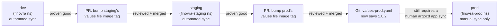

# Module 7: Environment Promotion Patterns

**Environment:** `kind` (local)
**Prerequisites:** Module 6 complete — dashboard deployed as an Argo Rollouts canary, `Synced`/`Healthy` on `1.0.2`

---

## Learning Objectives

By the end of this module, you should be able to:
- Build `staging` and `prod` Helm values files on top of Finovra's existing chart, each with its own environment-specific overrides
- Set up a PR-based promotion flow, and explain the difference between the two separate gates a change passes through before it's live in prod
- Explain what happens when you delete an `Application` object versus what happens to the resources it manages
- Use the App-of-Apps pattern to manage multiple `Application` objects from one root, instead of `kubectl apply`-ing each by hand

---

## 1. A Deliberate Step Back: Rollout → Deployment for This Module

Module 6 converted `dashboard` to an Argo Rollouts canary. This module reverts that — on purpose, not as an undo of Module 6's lesson.

Promotion is what this module teaches: two Git gates, one manual-sync gate, one shared chart across three environments. Canary is a *different* lesson, already taught in full in Module 6. Building this module's staging/prod environments on top of the `Rollout` would mean every promotion also triggers a canary step (`setWeight: 50`, analysis, the works) in staging and prod — which is realistic, but it teaches two things at once instead of one, and buries the promotion pattern this module is actually about under canary mechanics you've already seen. So: `dashboard` goes back to a plain `Deployment` here, and the canary/stable Services plus the `AnalysisTemplate` from Module 6 get removed, since nothing references them once the `Rollout` is gone. This is Step 1 of the lab, not an aside — do it before anything else in this module.

(If you want canary *and* promotion together for real, that's a natural next exercise once this module's pattern is solid — apply Module 6's `Rollout` conversion again, on top of what this module builds, and you'd get exactly that. Not part of this module's required path.)

---

## 2. Promoting dev → staging → prod

Finovra's existing `finovra` Application (Helm-based, namespace `finovra`) has been "dev" all along, without ever needing the label — every module so far has deployed straight to it. This module adds two new environments alongside it: **staging** and **prod**, each its own `Application`, each pointing at the *same* `helm-chart` path dev already uses, differing only in which values file each one layers on top.

A promotion is nothing more than **a PR that bumps one value in one values file** — normally the image tag, once you've proven it's good somewhere earlier in the chain:



Notice there are **two separate gates**, not one, and they guard different things:

1. **The PR review gate** — a human approves the PR before it merges to `main`. This gates *what's allowed into Git*. Set this up the same way you would for any repo: on GitHub, enable branch protection on `main` with "Require a pull request before merging."
2. **The manual-sync gate on `prod`** — even after the PR merges and Git says prod should be on `1.0.2`, nothing actually deploys until someone runs `argocd app sync finovra-prod` (or clicks **Sync** in the UI). This is `syncPolicy` with no `automated:` block at all, deliberately left manual here.

That second gate is what the syllabus calls "a manual approval gate before prod," and it's a real, common pattern — merging code and deploying code are two different actions, and prod is exactly where teams want that gap to be explicit rather than automatic. `staging`, by contrast, stays `automated` — the whole point of a staging environment is that it deploys itself the moment something merges, so it stays a faithful preview of what prod is about to get.

---

## 3. App-of-Apps: One Root, Many Applications

You'll build `staging` and `prod` by hand first in this module's lab — `kubectl apply -f apps/finovra-staging.yaml`, same as every `Application` you've applied since Module 3. That's fine for a couple of environments. It gets tedious fast once you're managing several — and error-prone, since nothing stops someone from forgetting to apply one of them, or applying a stale copy.

**App-of-Apps** solves this by making the list of `Application` objects itself something ArgoCD manages: one root `Application` whose "app" is a folder of other `Application` manifests.

```yaml
# apps/root.yaml
apiVersion: argoproj.io/v1alpha1
kind: Application
metadata:
  name: finovra-root
  namespace: argocd
spec:
  project: default
  source:
    repoURL: https://github.com/<your-username>/gitops.git
    targetRevision: main
    path: apps
  destination:
    server: https://kubernetes.default.svc
    namespace: argocd
  syncPolicy:
    automated:
      prune: true
      selfHeal: true
```

This is the plain-YAML directory source type — nothing new there — except what it's managing is a folder of `Application` objects rather than a folder of Deployments/Services. Apply `root.yaml` once, and everything already sitting in `apps/` (`finovra.yaml`, `finovra-staging.yaml`, `finovra-prod.yaml`) gets picked up and kept in sync automatically — including files that were already there from being applied by hand earlier. Add a fourth environment later, and it's a fourth file in `apps/` plus a `git push` — no new `kubectl apply` command to remember.

**Deleting an `Application` object does not delete what it deployed**, unless that `Application` carries the `resources-finalizer.argocd.argoproj.io` finalizer. None of Finovra's `Application`s have one. That matters for this module's lab: when you delete `finovra-staging`/`finovra-prod` by hand in Step 5, their Deployments/Services keep running, just briefly unmanaged — and when `root.yaml` recreates equivalent `Application` objects from the same files, it **adopts** those already-running resources instead of recreating them. Same namespace, same names, nothing to reconcile away.

`apps/` staying one level deep (only `Application` manifests, no subfolders) is what you want here — that's `source.directory.recurse`'s job to control, and its default is already `false`. **Don't write `directory: {recurse: false}` explicitly, even though it's tempting to be explicit about it:** `recurse` is a boolean that gets silently dropped whenever it's `false`, since `false` and "not set" serialize identically. Git would keep declaring it, the live `Application` object would never actually store it, and every reconciliation would see phantom drift and report `OutOfSync` forever, even though nothing is actually wrong — a real, easy-to-hit gotcha, not hypothetical. Leaving the field out entirely means there's nothing for that mismatch to happen to. If you ever need nested app-of-apps (a root managing other roots), that's when you'd set `recurse: true` for real — a non-default value serializes and persists just fine.

---

## Lab: Build a Staging → Prod Promotion Flow

All of this happens in your fork of `gitops`.

### Step 1 — Revert dashboard from a Rollout back to a Deployment

Per Section 1: this module builds on a plain `Deployment`, deliberately, so promotion stays the only new concept this module introduces. Replace `helm-chart/templates/dashboard.yaml`'s content with this in full:

```yaml
apiVersion: apps/v1
kind: Deployment
metadata:
  name: dashboard
  labels:
    app: dashboard
spec:
  replicas: {{ .Values.dashboard.replicas }}
  selector:
    matchLabels:
      app: dashboard
  template:
    metadata:
      labels:
        app: dashboard
    spec:
      containers:
        - name: dashboard
          image: "{{ .Values.image.repository }}/finovra-dashboard:{{ .Values.dashboard.image.tag | default .Values.image.tag }}"
          ports:
            - containerPort: {{ .Values.dashboard.service.port }}
          env:
            - name: PORT
              value: "{{ .Values.dashboard.service.port }}"
            - name: VERSION
              value: "{{ .Values.dashboard.image.tag | default .Values.image.tag }}"
            - name: SERVICES
              value: "accounts:http://accounts-service:{{ (index .Values "accounts-service").service.port }},insurance:http://insurance-service:{{ (index .Values "insurance-service").service.port }},investments:http://investments-service:{{ (index .Values "investments-service").service.port }},loans:http://loans-service:{{ (index .Values "loans-service").service.port }}"
          livenessProbe:
            httpGet:
              path: /
              port: {{ .Values.dashboard.service.port }}
            initialDelaySeconds: 3
          readinessProbe:
            httpGet:
              path: /
              port: {{ .Values.dashboard.service.port }}
            initialDelaySeconds: 3
          resources:
            requests:
              cpu: 50m
              memory: 64Mi
            limits:
              cpu: 100m
              memory: 128Mi
---
apiVersion: v1
kind: Service
metadata:
  name: dashboard
  labels:
    app: dashboard
spec:
  selector:
    app: dashboard
  ports:
    - port: {{ .Values.dashboard.service.port }}
      targetPort: {{ .Values.dashboard.service.port }}
```

Delete `helm-chart/templates/dashboard-canary.yaml` entirely — the canary/stable Services and `AnalysisTemplate` it defines have nothing to attach to once the `Rollout` is gone.

Sanity-check and ship it on its own, before adding anything else:

```bash
helm lint helm-chart
helm template finovra helm-chart | grep -A2 "kind: Deployment"
git add helm-chart/templates/dashboard.yaml
git rm helm-chart/templates/dashboard-canary.yaml
git commit -m "Step back to a plain Deployment for the promotion module"
git push origin main
```

Confirm `argocd app get finovra` settles back to `Synced`/`Healthy` on a plain `Deployment` before moving on.

### Step 2 — Add the staging values file

Create `helm-chart/values-staging.yaml`:

```yaml
dashboard:
  replicas: 2
  image:
    tag: "1.0.2"
```

The `image.tag` line is the piece that makes this a *promotion* file rather than just another environment copy — it's the one line a promotion PR will actually touch going forward. Render it locally before moving on:

```bash
helm template finovra helm-chart -f helm-chart/values-staging.yaml | grep -A2 "kind: Deployment"
```

Confirm `dashboard`'s image reads `arsr319/finovra-dashboard:1.0.2` and its `replicas: 2`, while all four backends stay at whatever `values.yaml`'s defaults declare.

### Step 3 — Add the prod values file

Create `helm-chart/values-prod.yaml`:

```yaml
dashboard:
  replicas: 3
  image:
    tag: "1.0.0"
```

Note prod deliberately starts pinned to `1.0.0`, one step behind staging's `1.0.2` — that gap is what you'll close with a real promotion PR later in this lab. Render and sanity-check the same way as Step 2.

> **If Finovra used Kustomize for this instead:** you'd build `kustomize/overlays/staging` and `kustomize/overlays/prod`, each a base reference plus `replicas:`/`images:` transformers:
>
> ```yaml
> # kustomize/overlays/staging/kustomization.yaml
> resources:
>   - ../../base
> replicas:
>   - name: dashboard
>     count: 2
> images:
>   - name: arsr319/finovra-dashboard
>     newTag: "1.0.2"
> ```
>
> The `Application` would point at the overlay path instead of a values file (`path: kustomize/overlays/staging`), and a promotion PR would bump `kustomize/overlays/prod/kustomization.yaml`'s `images.newTag` instead of `values-prod.yaml`'s `dashboard.image.tag` — same promotion mechanic, same two gates from Section 2, just expressed through Kustomize's transformers instead of Helm's override system. This module builds the Helm version for real, since dev is already Helm — but the pattern itself isn't tool-specific, and you'd land in the same place either way. Module 4 covers Kustomize in full if you want to see this side built out for real.

### Step 4 — Add and apply the two new Applications by hand

Create `apps/finovra-staging.yaml`:

```yaml
apiVersion: argoproj.io/v1alpha1
kind: Application
metadata:
  name: finovra-staging
  namespace: argocd
spec:
  project: default
  source:
    repoURL: https://github.com/<your-username>/gitops.git
    targetRevision: main
    path: helm-chart
    helm:
      valueFiles:
        - values-staging.yaml
  destination:
    server: https://kubernetes.default.svc
    namespace: finovra-staging
  syncPolicy:
    automated:
      prune: true
      selfHeal: true
    syncOptions:
      - CreateNamespace=true
```

Create `apps/finovra-prod.yaml` — same shape, **no `automated:` block**:

```yaml
apiVersion: argoproj.io/v1alpha1
kind: Application
metadata:
  name: finovra-prod
  namespace: argocd
spec:
  project: default
  source:
    repoURL: https://github.com/<your-username>/gitops.git
    targetRevision: main
    path: helm-chart
    helm:
      valueFiles:
        - values-prod.yaml
  destination:
    server: https://kubernetes.default.svc
    namespace: finovra-prod
  syncPolicy:
    syncOptions:
      - CreateNamespace=true
```

Commit and push everything from Steps 2–4 together, then apply both `Application`s by hand — the same way you've applied every `Application` since Module 3:

```bash
git add helm-chart/values-staging.yaml helm-chart/values-prod.yaml apps/finovra-staging.yaml apps/finovra-prod.yaml
git commit -m "Add staging/prod values files and Applications"
git push origin main

kubectl apply -f apps/finovra-staging.yaml
kubectl apply -f apps/finovra-prod.yaml
argocd app list
```

Confirm `finovra-staging` shows `Synced`/`Healthy` on its own (it's `automated`). `finovra-prod` should show `OutOfSync` — that's expected: nothing has synced it yet, on purpose.

```bash
argocd app sync finovra-prod
argocd app get finovra-prod
```

That manual command **is** the approval gate from Section 2 — confirm `finovra-prod` settles to `Synced`/`Healthy` running `1.0.0`, one version behind staging's `1.0.2`.

### Step 5 — Delete both Applications, watch the resources survive

This is the pain App-of-Apps solves, made visible before you reach for the fix. Delete both `Application` objects:

```bash
kubectl delete -f apps/finovra-staging.yaml
kubectl delete -f apps/finovra-prod.yaml
argocd app list
```

Neither `finovra-staging` nor `finovra-prod` should show up anymore. Now check the actual workloads:

```bash
kubectl get pods -n finovra-staging
kubectl get pods -n finovra-prod
```

Still running — deleting an `Application` doesn't delete what it deployed unless it carries the `resources-finalizer.argocd.argoproj.io` finalizer, and neither of these files has one (check `metadata:` in each if you want to confirm). Right now, both namespaces are running Pods with nothing in ArgoCD managing them.

### Step 6 — Introduce App-of-Apps, watch it adopt what's already running

Create `apps/root.yaml` (the exact file shown in Section 3):

```yaml
apiVersion: argoproj.io/v1alpha1
kind: Application
metadata:
  name: finovra-root
  namespace: argocd
spec:
  project: default
  source:
    repoURL: https://github.com/<your-username>/gitops.git
    targetRevision: main
    path: apps
  destination:
    server: https://kubernetes.default.svc
    namespace: argocd
  syncPolicy:
    automated:
      prune: true
      selfHeal: true
```

`apps/finovra-staging.yaml` and `apps/finovra-prod.yaml` are still sitting in the repo from Step 4 — you never removed the files, only the live `Application` objects. Commit and push just `root.yaml`, then apply it once:

```bash
git add apps/root.yaml
git commit -m "Add an App-of-Apps root"
git push origin main

kubectl apply -f apps/root.yaml
argocd app get finovra-root
```

Within moments, `finovra-staging` and `finovra-prod` should both exist again as `Application` objects, without you applying either directly:

```bash
argocd app list
```

Confirm both come back `Synced`/`Healthy` (staging) / `Synced`/`Healthy` after a sync (prod — you'll need `argocd app sync finovra-prod` once more, since prod is still manual-sync-only even under the root). Then confirm this was adoption, not a redeploy — same Pods, not new ones:

```bash
kubectl get pods -n finovra-staging
kubectl get pods -n finovra-prod
```

Compare Pod names/ages against what you saw in Step 5 — unchanged. `root.yaml` picked up the same two files, created `Application` objects with the same names targeting the same namespaces, and ArgoCD reconciled against what was already there instead of recreating it. This is the last time you `kubectl apply` an `Application` by hand in this module — from here, everything in `apps/` is `root`'s responsibility.

### Step 7 — Run a real promotion

Open a PR (not a direct push to `main`) that changes exactly one line — `helm-chart/values-prod.yaml`'s `dashboard.image.tag`, from `"1.0.0"` to `"1.0.2"`:

```bash
git checkout -b promote-prod-1.0.2
# edit helm-chart/values-prod.yaml: image.tag: "1.0.2"
git add helm-chart/values-prod.yaml
git commit -m "Promote prod to 1.0.2"
git push origin promote-prod-1.0.2
gh pr create --title "Promote prod to 1.0.2" --body "staging has been on 1.0.2 since Step 2 with no issues."
```

Review and merge it (through GitHub, same as any real PR). Then check ArgoCD:

```bash
argocd app get finovra-prod
```

**`Sync Status: OutOfSync`** — Git now says `1.0.2`, but prod is still running `1.0.0`. The PR merging didn't deploy anything; it only changed what Git declares. Only now does the second gate apply:

```bash
argocd app sync finovra-prod
argocd app get finovra-prod
kubectl get deployment dashboard -n finovra-prod -o jsonpath='{.spec.template.spec.containers[0].image}'
```

**Checkpoint:** you built a real two-environment promotion flow — a PR review gate on Git, and a separate manual-sync gate on ArgoCD before anything reaches prod — first by hand, then watched an App-of-Apps root adopt the exact same environments without redeploying anything.

---

## Key Terms Glossary

| Term | Meaning |
|---|---|
| **Promotion** | A PR that changes one value (usually an image tag) in one environment's values file, moving a proven release to the next environment |
| **PR review gate** | Branch protection requiring a reviewed, merged PR before a change lands on `main` — gates what's *allowed into Git* |
| **Manual-sync gate** | An `Application` with no `automated:` sync policy — gates what's *allowed to actually deploy*, independent of the PR gate |
| **App-of-Apps** | A root `Application` whose source is a folder of other `Application` manifests, so ArgoCD manages the app list itself instead of you applying each one by hand |
| **Adoption** | When a new `Application` targets a namespace/resources an old (now-deleted) `Application` already created — ArgoCD reconciles against what's already running instead of recreating it, as long as neither had the cascading-delete finalizer |
| **`resources-finalizer.argocd.argoproj.io`** | The finalizer that makes deleting an `Application` also delete everything it deployed. None of Finovra's `Application`s carry it, which is why Step 5's deletes don't take workloads down |

---

## Recap Questions

1. Why does this module revert `dashboard` from a `Rollout` back to a `Deployment` before building anything else — what would layering promotion on top of the canary have cost pedagogically?
2. `finovra-staging` and `finovra-prod` are both `Synced` to the same Git commit at some point in Step 7. Why does only one of them actually have `1.0.2` running?
3. In Step 5, why did the Pods in `finovra-staging`/`finovra-prod` keep running after their `Application` objects were deleted?
4. In Step 6, how could you tell App-of-Apps *adopted* the existing Pods rather than recreating them?

---

## What's Next

In **Module 8**, we stop hand-maintaining `apps/finovra-staging.yaml` and `apps/finovra-prod.yaml` as separate files and generate `Application` objects like them automatically with an `ApplicationSet` — the pattern that scales once you're managing many services or many environments instead of a handful of files in one folder.
