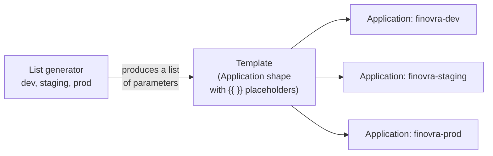

# Module 8: Scaling to Many Apps — ApplicationSets

**Environment:** `kind` (local)
**Prerequisites:** Module 7 complete — `finovra`/`finovra-staging`/`finovra-prod` all managed from one App-of-Apps root

---

## Learning Objectives

By the end of this module, you should be able to:
- Explain why hand-writing one `Application` YAML per environment stops scaling, and what an `ApplicationSet` replaces that with
- Generate a fixed set of `Application`s from a static list using the **List generator**
- Read an `ApplicationSet`'s `generators`/`template` split and explain what each half is responsible for
- Explain the trade-off of sharing one `syncPolicy` across every generated `Application`, and where a manual approval gate has to live instead

---

## 1. The Problem: One YAML Per App Stops Scaling

Count what you're maintaining by hand right now: `apps/finovra.yaml`, `apps/finovra-staging.yaml`, `apps/finovra-prod.yaml`, plus `apps/root.yaml` to tie them together — four files, for **one app across three environments**. That was already a little repetitive; `finovra-staging.yaml` and `finovra-prod.yaml` differ from each other in exactly two fields (`path`, `destination.namespace`) and are otherwise identical copy-paste. `finovra.yaml` differs a bit more (it's Helm-based, the others are Kustomize-based), but the same shape — one hand-maintained file per environment — is still the thing doing the least amount of actual work.

Now imagine Finovra had ten environments instead of three — dev, staging, prod, plus a handful of short-lived preview environments. That's ten near-identical YAML files, each one a chance to typo a namespace, forget `CreateNamespace=true`, or drift out of sync with the pattern everyone else is copying from.

**`ApplicationSet`** solves this by splitting the problem in two: a **generator** produces a list of "here's what varies" (an environment name, a path, a namespace), and a **template** describes "here's the `Application` shape, with placeholders for whatever the generator gives me." One `ApplicationSet` object, applied once, produces and keeps in sync as many `Application` objects as the generator finds.



There's nothing separate to install here — the ApplicationSet controller ships bundled with ArgoCD's own Helm chart and has been running in your cluster since you first installed ArgoCD, whether you'd used it yet or not:

```bash
kubectl get pods -n argocd | grep applicationset
```

This module covers the **List generator** — a fixed, hand-written set of items, best for a small, stable set that doesn't come from scanning a repo, which describes "our environments" well. (ArgoCD supports several more — Git directory/file, Matrix, SCM Provider, Pull Request — genuinely useful once you're generating `Application`s from repo structure rather than a fixed list, but out of scope here.)

---

## 2. The List Generator

The simplest possible generator: a literal, static list of items, written directly in the `ApplicationSet` spec. Each item's fields become placeholders you can reference in `template`.

Here's what your entire `apps/` folder — `finovra.yaml`, `finovra-staging.yaml`, `finovra-prod.yaml` — collapses into as one `ApplicationSet`:

```yaml
apiVersion: argoproj.io/v1alpha1
kind: ApplicationSet
metadata:
  name: finovra-environments
  namespace: argocd
spec:
  generators:
    - list:
        elements:
          - env: dev
            path: helm-chart
            namespace: finovra
          - env: staging
            path: kustomize/overlays/staging
            namespace: finovra-staging
          - env: prod
            path: kustomize/overlays/prod
            namespace: finovra-prod
  template:
    metadata:
      name: 'finovra-{{env}}'
    spec:
      project: default
      source:
        repoURL: https://github.com/finovra-app/gitops.git
        targetRevision: main
        path: '{{path}}'
      destination:
        server: https://kubernetes.default.svc
        namespace: '{{namespace}}'
      syncPolicy:
        automated:
          prune: true
          selfHeal: true
        syncOptions:
          - CreateNamespace=true
```

Three `elements`, one `template` — the rendered result is functionally identical to three hand-written `Application`s, one per environment, just generated instead of copy-pasted, all sharing one `syncPolicy` (`automated: { prune: true, selfHeal: true }`), so a push to `main` rolls out to dev, staging, and prod the same way.

---

## 3. A Note on Dev's Helm Values

Today's `apps/finovra.yaml` deploys the Helm chart with `helm.valueFiles: [values-dev.yaml]`. Check what that file actually overrides:

```yaml
# helm-chart/values-dev.yaml
dashboard:
  replicas: 3
```

```yaml
# helm-chart/values.yaml (defaults)
dashboard:
  replicas: 3
  ...
```

It's a no-op — `values-dev.yaml` sets `dashboard.replicas` to the exact value the chart's default already has. That's why the template above deploys `helm-chart` with **no `helm.valueFiles` block at all**: dropping it changes nothing about what gets deployed today, and it's what keeps the template uniform across all three environments (same shape, just `path` and `namespace` differ per element).

**If you later give `values-dev.yaml` a real override** (something that actually differs from `values.yaml`), this uniform template can no longer express it — a plain List generator's `{{ }}` placeholders only fill in scalar values, they can't switch a whole `helm:` block on for one element and off for the others. You'd need either a dedicated single-element `ApplicationSet` for dev, or `spec.goTemplate: true` with a conditional block. Worth knowing now, not surprising later.

---

## 4. Why This Is Safe (No Downtime)

Deleting an `Application` object in ArgoCD does **not** delete the Kubernetes resources it manages, unless that `Application` carries the `resources-finalizer.argocd.argoproj.io` finalizer. None of `finovra.yaml`, `finovra-staging.yaml`, or `finovra-prod.yaml` have one — check `metadata:` in each file if you want to confirm yourself. So when `root.yaml` prunes the old `Application` objects (because their files are gone from `apps/`):

- The `Deployment`s/`Service`s already running in the `finovra`, `finovra-staging`, `finovra-prod` namespaces **keep running**, now briefly unmanaged by any `Application`.
- The new `ApplicationSet`-generated `Application`s (`finovra-dev`, `finovra-staging`, `finovra-prod`) target the **same namespace and the same source path** as the ones they replace, so when they sync, they simply **adopt** the already-running resources instead of recreating them. Same `Deployment` names, same `Service` names, same namespace — nothing to reconcile away.

One thing worth flagging: dev's `Application` is renamed from `finovra` to `finovra-dev` (matching the `{{env}}` template pattern used for all three). This is a rename of the `Application` object only — the underlying `Deployment`s/`Service`s in the `finovra` namespace are untouched and get adopted the same way. `staging` and `prod` keep their existing names (`finovra-staging`, `finovra-prod`), so nothing is renamed for them at all.

---

## 5. Trade-off Worth Knowing: No Manual Gate on Prod

With `syncPolicy.automated` shared across all three elements, a push to `main` that touches `kustomize/overlays/prod/` rolls out to prod the same way it rolls out to dev and staging — automatically, no approval step in ArgoCD itself.

If you want a human checkpoint before prod changes, it now has to live **before** the push — e.g. a required PR review/approval on `kustomize/overlays/prod/` in the `gitops` repo, or a promotion step gated by a separate approval process, rather than inside the `ApplicationSet` itself. ArgoCD is still the thing making prod match git; the question of *when* git is allowed to change is entirely a Git-hosting concern (branch protection, CODEOWNERS, required reviewers), not an ArgoCD one.

---

## Lab: Migrate to a Single ApplicationSet

All of this happens in your fork of `gitops`.

### Step 1 — Write `apps/finovra-environments.yaml`

```yaml
apiVersion: argoproj.io/v1alpha1
kind: ApplicationSet
metadata:
  name: finovra-environments
  namespace: argocd
spec:
  generators:
    - list:
        elements:
          - env: dev
            path: helm-chart
            namespace: finovra
          - env: staging
            path: kustomize/overlays/staging
            namespace: finovra-staging
          - env: prod
            path: kustomize/overlays/prod
            namespace: finovra-prod
  template:
    metadata:
      name: 'finovra-{{env}}'
    spec:
      project: default
      source:
        repoURL: https://github.com/finovra-app/gitops.git
        targetRevision: main
        path: '{{path}}'
      destination:
        server: https://kubernetes.default.svc
        namespace: '{{namespace}}'
      syncPolicy:
        automated:
          prune: true
          selfHeal: true
        syncOptions:
          - CreateNamespace=true
```

### Step 2 — Delete the old per-environment `Application` files

```bash
git rm apps/finovra.yaml apps/finovra-staging.yaml apps/finovra-prod.yaml
```

### Step 3 — Preview before applying

`argocd appset generate` renders exactly what the `ApplicationSet` would produce, without creating anything — the `ApplicationSet` equivalent of `helm template` or `kubectl kustomize`:

```bash
argocd appset generate apps/finovra-environments.yaml
```

Confirm it renders exactly three `Application`s — `finovra-dev` (namespace `finovra`, source `helm-chart`), `finovra-staging` (namespace `finovra-staging`, source `kustomize/overlays/staging`), and `finovra-prod` (namespace `finovra-prod`, source `kustomize/overlays/prod`) — each with the same `syncPolicy.automated` block.

### Step 4 — Commit and push

```bash
git add apps/finovra-environments.yaml
git commit -m "Replace per-environment Applications with a single ApplicationSet"
git push origin main
```

### Step 5 — Let root sync, then verify

`root.yaml` auto-syncs on its own poll interval, or force it immediately:

```bash
argocd app sync finovra-root
argocd app list
```

You should see `finovra-dev`, `finovra-staging`, and `finovra-prod` all reach `Synced`/`Healthy` on their own within moments — no manual step for any of them.

```bash
kubectl get pods -n finovra -n finovra-staging -n finovra-prod
```

Confirm pods keep running throughout — this is the adoption behavior from Section 4, not a redeploy.

### Step 6 — Prove it reacts the same way in every environment

Make a trivial change under `kustomize/overlays/prod/` (e.g. bump a replica count or image tag comment), push it, and watch:

```bash
argocd app get finovra-prod
```

It should self-heal to `Synced` on its own, the same way `finovra-staging` would for an equivalent change under `kustomize/overlays/staging/` — no manual sync needed for either.

---

## Key Terms Glossary

| Term | Meaning |
|---|---|
| **`ApplicationSet`** | A CRD that generates and keeps in sync many `Application` objects from one definition, instead of one hand-written YAML per app |
| **Generator** | The half of an `ApplicationSet` that produces a list of parameters — the `list` generator (a static, hand-written set) in this module |
| **Template** | The half of an `ApplicationSet` describing the `Application` shape, with `{{ }}` placeholders filled in per generator item |
| **List generator** | A fixed, hand-written set of items (`elements:`) — best for a small, stable set that doesn't come from scanning a repo, like a list of environments |
| **Adoption** | When a new `Application` targets a namespace/resources an old (now-deleted) `Application` already created — ArgoCD reconciles against what's already running instead of recreating it, as long as neither had the cascading-delete finalizer |
| **`resources-finalizer.argocd.argoproj.io`** | The finalizer that makes deleting an `Application` also delete everything it deployed. None of this repo's `Application`s carry it, which is why deleting the old `Application` files here doesn't take workloads down |
| **`argocd appset generate`** | Renders what an `ApplicationSet` would produce, without applying anything — the ApplicationSet equivalent of `helm template`/`kubectl kustomize` |

---

## Recap Questions

1. What specifically would you edit to change all three environments' `repoURL` at once?
2. What specifically in an `Application`'s YAML determines whether deleting it also deletes the resources it deployed — and do any of this repo's `Application`s have it?
3. `values-dev.yaml` was dropped from the template entirely. Why was that safe to do today, and what would make it unsafe in the future?
4. Since ArgoCD no longer gates prod changes with a manual sync, where does Section 5 say the approval checkpoint should live instead?
5. If a fourth environment (say, `qa`) needed the exact same treatment as `dev`/`staging`/`prod`, what's the smallest change that would deploy it?

---

## What's Next

In **Module 9**, we go multi-cluster — registering a second `kind` cluster with ArgoCD and deploying Finovra to both, the same pattern real teams use for a dedicated staging cluster alongside production rather than shared namespaces on one cluster.
