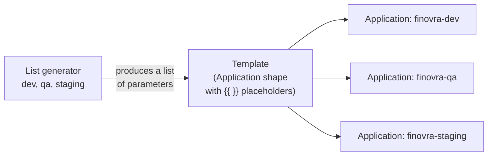
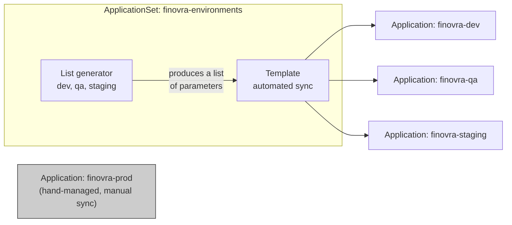

# Module 8: Scaling to Many Apps — ApplicationSets

**Environment:** `kind` (local)
**Prerequisites:** Module 7 complete — `finovra`/`finovra-staging`/`finovra-prod`/`finovra-qa` all managed from one App-of-Apps root

---

## Learning Objectives

By the end of this module, you should be able to:
- Explain why hand-writing one `Application` YAML per environment stops scaling, and what an `ApplicationSet` replaces that with
- Generate a fixed set of `Application`s from a static list using the **List generator**
- Read an `ApplicationSet`'s `generators`/`template` split and explain what each half is responsible for
- Explain why `prod` is deliberately left out of the initial `ApplicationSet`, and what it costs to bring it in later

---

## 1. The Problem: One YAML Per App Stops Scaling

Count what you're maintaining by hand right now: `apps/finovra.yaml`, `apps/finovra-qa.yaml`, `apps/finovra-staging.yaml`, `apps/finovra-prod.yaml`, plus `apps/root.yaml` to tie them together — five files, for **one app across four environments**. That's already a lot of repetition: `finovra`, `finovra-qa`, and `finovra-staging` share the exact same `source.path` (`helm-chart`) and the exact same shape, differing only in which values file each one layers on top and which namespace it targets. One hand-maintained file per environment is still the thing doing the least amount of actual work here.

Now imagine Finovra had ten environments instead of four — dev, qa, staging, prod, plus a handful of short-lived preview environments. That's ten near-identical YAML files, each one a chance to typo a namespace, forget `CreateNamespace=true`, or drift out of sync with the pattern everyone else is copying from.

**`ApplicationSet`** solves this by splitting the problem in two: a **generator** produces a list of "here's what varies" (an environment name, a values file, a namespace), and a **template** describes "here's the `Application` shape, with placeholders for whatever the generator gives me." One `ApplicationSet` object, applied once, produces and keeps in sync as many `Application` objects as the generator finds.



There's nothing separate to install here — the ApplicationSet controller ships bundled with ArgoCD's own Helm chart and has been running in your cluster since you first installed ArgoCD, whether you'd used it yet or not:

```bash
kubectl get pods -n argocd | grep applicationset
```

This module covers the **List generator** — a fixed, hand-written set of items, best for a small, stable set that doesn't come from scanning a repo, which describes "our environments" well. (ArgoCD supports several more — Git directory/file, Matrix, SCM Provider, Pull Request — genuinely useful once you're generating `Application`s from repo structure rather than a fixed list, but out of scope here.)

---

## 2. The List Generator — Dev, QA, Staging, Not Prod

The simplest possible generator: a literal, static list of items, written directly in the `ApplicationSet` spec. Each item's fields become placeholders you can reference in `template`.

Notice `prod` isn't one of the elements. That's deliberate, not an oversight — every element in a List generator shares the *same* `template`, including one `syncPolicy`. `finovra-prod` has no `automated:` block at all; that manual-sync gate is the entire point of Module 7's promotion flow. `dev`, `qa`, and `staging` all agree on `automated: { prune: true, selfHeal: true }`, so they fold cleanly into one template — `prod` doesn't, so it stays its own hand-managed `Application` for now:



Here's what `finovra.yaml`, `finovra-qa.yaml`, and `finovra-staging.yaml` collapse into as one `ApplicationSet` — `finovra-prod.yaml` stays exactly as it already is:

```yaml
apiVersion: argoproj.io/v1alpha1
kind: ApplicationSet
metadata:
  name: finovra-environments
  namespace: argocd
spec:
  generators:
    - list:
        elements:
          - env: dev
            namespace: finovra
            valuesFile: values-dev.yaml
          - env: qa
            namespace: finovra-qa
            valuesFile: values-qa.yaml
          - env: staging
            namespace: finovra-staging
            valuesFile: values-staging.yaml
  template:
    metadata:
      name: 'finovra-{{env}}'
    spec:
      project: default
      source:
        repoURL: https://github.com/finovra-app/gitops.git
        targetRevision: main
        path: helm-chart
        helm:
          valueFiles:
            - '{{valuesFile}}'
      destination:
        server: https://kubernetes.default.svc
        namespace: '{{namespace}}'
      syncPolicy:
        automated:
          prune: true
          selfHeal: true
        syncOptions:
          - CreateNamespace=true
```

Three `elements`, one `template` — the rendered result is functionally identical to three hand-written `Application`s, one per environment, just generated instead of copy-pasted. Notice every element has the exact same shape — `env`, `namespace`, `valuesFile` — nothing environment-specific about the structure itself, only the values. `prod` would fit that same shape too, structurally — it's excluded purely because of the `syncPolicy` mismatch, not because it couldn't be expressed. Section 5 comes back to exactly that.

---

## 3. Why the Template Stays Uniform Across dev/qa/staging

This is worth calling out because it wasn't always this clean. Before Module 7 moved staging onto Helm, dev pointed at `path: helm-chart` while staging pointed at a Kustomize overlay path — two genuinely different `source` shapes, which a plain List generator's scalar `{{ }}` placeholders can't express in one template (you'd have needed a conditional, or two separate generators). Now that every environment renders from the same chart, `source.path` is a fixed constant (`helm-chart`) and only `helm.valueFiles` varies — exactly the kind of single-scalar difference the List generator handles cleanly. `qa`, added fresh in Module 7, was never anything but Helm, so it slots into the same shape without any special-casing.

**Worth knowing for later, even though it doesn't bite here:** a List generator's placeholders only fill in scalar values — they can't switch a whole block on for one element and off for another. If some future environment needed to skip `helm.valueFiles` entirely (deploy the chart with zero overrides), or needed a second values file layered on top, the uniform template above couldn't express that difference on its own. You'd reach for either a dedicated single-element `ApplicationSet` for that one environment, or `spec.goTemplate: true` with a conditional block. Not a problem today — every environment here has exactly one values file — just the shape of the limitation to recognize if it shows up later.

---

## 4. Why This Is Safe (No Downtime)

Deleting an `Application` object in ArgoCD does **not** delete the Kubernetes resources it manages, unless that `Application` carries the `resources-finalizer.argocd.argoproj.io` finalizer. None of `finovra.yaml`, `finovra-qa.yaml`, or `finovra-staging.yaml` have one — check `metadata:` in each file if you want to confirm yourself. So when `root.yaml` prunes the old `Application` objects (because their files are gone from `apps/`):

- The `Deployment`s/`Service`s already running in the `finovra`, `finovra-qa`, `finovra-staging` namespaces **keep running**, now briefly unmanaged by any `Application`.
- The new `ApplicationSet`-generated `Application`s (`finovra-dev`, `finovra-qa`, `finovra-staging`) target the **same namespace and the same source path** as the ones they replace, so when they sync, they simply **adopt** the already-running resources instead of recreating them. Same `Deployment` names, same `Service` names, same namespace — nothing to reconcile away.

One thing worth flagging: dev's `Application` is renamed from `finovra` to `finovra-dev` (matching the `{{env}}` template pattern used for all three). This is a rename of the `Application` object only — the underlying `Deployment`s/`Service`s in the `finovra` namespace are untouched and get adopted the same way. `qa` and `staging` keep their existing names (`finovra-qa`, `finovra-staging`), so nothing is renamed for either. `finovra-prod` isn't touched at all in this migration — it's not part of the `ApplicationSet`, so there's nothing for `root.yaml` to prune or recreate there.

---

## 5. Bringing Prod In, If You Want To

`prod` stays out of `finovra-environments` for now because it wants a different `syncPolicy` than the other three, and a List generator's `template` can't give one element something the others don't share. But structurally, `prod` fits the exact same shape as `dev`/`qa`/`staging` — same `path: helm-chart`, same `helm.valueFiles` pattern, same `namespace` placeholder. If you're ever comfortable accepting **automated** sync on prod — no more manual-sync gate from Module 7 — bringing it in is nothing more than a fourth element:

```yaml
          - env: prod
            namespace: finovra-prod
            valuesFile: values-prod.yaml
```

Two things go with that one addition, not just the YAML:

1. **`apps/finovra-prod.yaml` has to go.** The `ApplicationSet` would generate an `Application` named `finovra-prod` — same name the hand-written file already uses. Two objects can't own the same name, so `git rm apps/finovra-prod.yaml` is part of this change, exactly like Step 2 removed the other three.
2. **The manual-sync gate is gone the moment this merges.** Every element shares the template's `syncPolicy.automated` block — there's no way to fold `prod` in while keeping it manual-only. This is the real trade-off, not a technicality: a push to `main` that touches `values-prod.yaml` now rolls out to prod the same way it rolls out to dev, qa, and staging — automatically, no approval step in ArgoCD itself.

If you still want a human checkpoint before prod changes after making this switch, it has to live **before** the push — e.g. a required PR review/approval on `helm-chart/values-prod.yaml` in the `gitops` repo — rather than inside the `ApplicationSet`. ArgoCD is still the thing making prod match Git; the question of *when* Git is allowed to change becomes entirely a Git-hosting concern (branch protection, CODEOWNERS, required reviewers), not an ArgoCD one.

---

## Lab: Migrate to a Single ApplicationSet

All of this happens in your fork of `gitops`.

### Step 1 — Write `apps/finovra-environments.yaml`

```yaml
apiVersion: argoproj.io/v1alpha1
kind: ApplicationSet
metadata:
  name: finovra-environments
  namespace: argocd
spec:
  generators:
    - list:
        elements:
          - env: dev
            namespace: finovra
            valuesFile: values-dev.yaml
          - env: qa
            namespace: finovra-qa
            valuesFile: values-qa.yaml
          - env: staging
            namespace: finovra-staging
            valuesFile: values-staging.yaml
  template:
    metadata:
      name: 'finovra-{{env}}'
    spec:
      project: default
      source:
        repoURL: https://github.com/finovra-app/gitops.git
        targetRevision: main
        path: helm-chart
        helm:
          valueFiles:
            - '{{valuesFile}}'
      destination:
        server: https://kubernetes.default.svc
        namespace: '{{namespace}}'
      syncPolicy:
        automated:
          prune: true
          selfHeal: true
        syncOptions:
          - CreateNamespace=true
```

### Step 2 — Delete the old dev/qa/staging `Application` files — leave prod alone

```bash
git rm apps/finovra.yaml apps/finovra-qa.yaml apps/finovra-staging.yaml
```

`apps/finovra-prod.yaml` stays untouched — it's not part of this `ApplicationSet`, per Section 2.

### Step 3 — Preview before applying

`argocd appset generate` renders exactly what the `ApplicationSet` would produce, without creating anything — the `ApplicationSet` equivalent of `helm template` or `kubectl kustomize`:

```bash
argocd appset generate apps/finovra-environments.yaml
```

Confirm it renders exactly three `Application`s, all sourcing `helm-chart` — `finovra-dev` (namespace `finovra`, `values-dev.yaml`), `finovra-qa` (namespace `finovra-qa`, `values-qa.yaml`), and `finovra-staging` (namespace `finovra-staging`, `values-staging.yaml`) — each with the same `syncPolicy.automated` block. No `finovra-prod` in this output — that's expected.

### Step 4 — Commit and push

```bash
git add apps/finovra-environments.yaml
git commit -m "Replace dev/qa/staging Applications with a single ApplicationSet"
git push origin main
```

### Step 5 — Let root sync, then verify

`root.yaml` auto-syncs on its own poll interval, or force it immediately:

```bash
argocd app sync finovra-root
argocd app list
```

You should see `finovra-dev`, `finovra-qa`, and `finovra-staging` all reach `Synced`/`Healthy` on their own within moments — no manual step for any of them. `finovra-prod` is still there too, untouched, still manual-sync-only.

```bash
kubectl get pods -n finovra -n finovra-qa -n finovra-staging
```

Confirm pods keep running throughout — this is the adoption behavior from Section 4, not a redeploy.

### Step 6 — Prove it reacts the same way in every generated environment

Make a trivial change to `helm-chart/values-staging.yaml` (e.g. bump a replica count or add a comment), push it, and watch:

```bash
argocd app get finovra-staging
```

It should self-heal to `Synced` on its own, the same way `finovra-qa` would for an equivalent change to `values-qa.yaml` — no manual sync needed for either. Try the same edit on `values-prod.yaml` and confirm the difference: nothing happens until you `argocd app sync finovra-prod` yourself. That's the gate from Section 5 still standing, exactly as it did before this module.

### Step 7 — Optional: bring prod into the set

Per Section 5: add the fourth `list` element for `env: prod`, `git rm apps/finovra-prod.yaml` in the same commit, push, and watch `finovra-prod` reappear as an `ApplicationSet`-generated `Application` — this time syncing automatically, no manual step. Worth doing once just to feel the trade-off firsthand: the same push that used to just update Git now actually deploys.

---

## Key Terms Glossary

| Term | Meaning |
|---|---|
| **`ApplicationSet`** | A CRD that generates and keeps in sync many `Application` objects from one definition, instead of one hand-written YAML per app |
| **Generator** | The half of an `ApplicationSet` that produces a list of parameters — the `list` generator (a static, hand-written set) in this module |
| **Template** | The half of an `ApplicationSet` describing the `Application` shape, with `{{ }}` placeholders filled in per generator item — shared identically across every generated `Application`, `syncPolicy` included |
| **List generator** | A fixed, hand-written set of items (`elements:`) — best for a small, stable set that doesn't come from scanning a repo, like a list of environments |
| **Adoption** | When a new `Application` targets a namespace/resources an old (now-deleted) `Application` already created — ArgoCD reconciles against what's already running instead of recreating it, as long as neither had the cascading-delete finalizer |
| **`resources-finalizer.argocd.argoproj.io`** | The finalizer that makes deleting an `Application` also delete everything it deployed. None of this repo's `Application`s carry it, which is why deleting the old `Application` files here doesn't take workloads down |
| **`argocd appset generate`** | Renders what an `ApplicationSet` would produce, without applying anything — the ApplicationSet equivalent of `helm template`/`kubectl kustomize` |

---

## Recap Questions

1. Why is `prod` left out of `finovra-environments`, even though its `Application` shape is otherwise identical to `dev`/`qa`/`staging`?
2. What specifically would you edit to change all three generated environments' `repoURL` at once?
3. What specifically in an `Application`'s YAML determines whether deleting it also deletes the resources it deployed — and do any of this repo's `Application`s have it?
4. Before Module 7, dev's `source.path` (`helm-chart`) and staging's (a Kustomize overlay) were structurally different. Why does today's single template work cleanly where that mix wouldn't have?
5. If you bring `prod` into the `ApplicationSet` (Step 7), what specifically do you lose that you had in Module 7 — and where would you have to enforce it instead?

---

## What's Next

In **Module 9**, we go multi-cluster — registering a second `kind` cluster with ArgoCD and deploying Finovra to both, the same pattern real teams use for a dedicated staging cluster alongside production rather than shared namespaces on one cluster.
