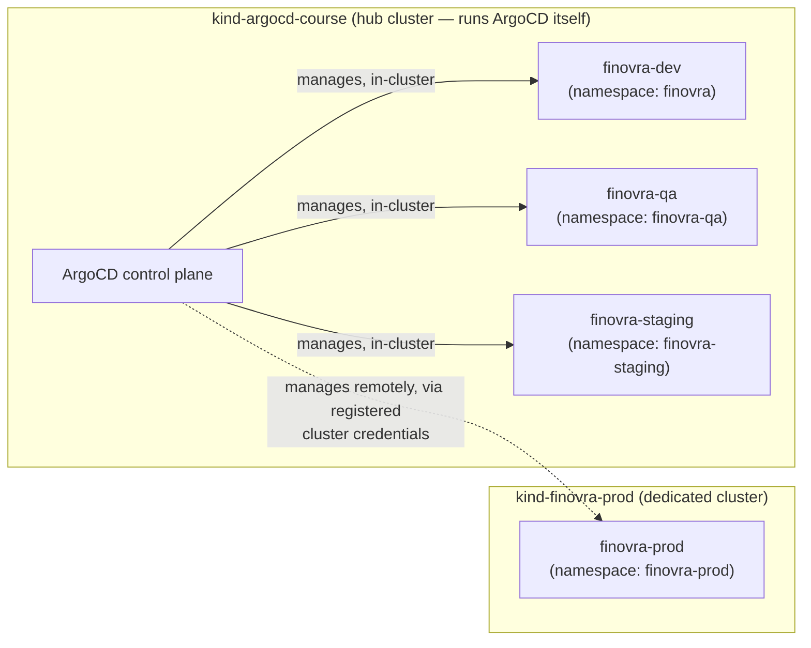

# Module 9: Multi-Cluster Basics

**Environment:** `kind` (local)
**Prerequisites:** Module 8 complete, including Step 7 (folding `prod` into the `ApplicationSet`) — `finovra-dev`/`finovra-qa`/`finovra-staging`/`finovra-prod` all generated by one `ApplicationSet`, all `Synced`/`Healthy` on the same `kind` cluster

---

## Learning Objectives

By the end of this module, you should be able to:
- Explain why real teams often give prod its own cluster instead of just its own namespace
- Register an external `kind` cluster with ArgoCD using `argocd cluster add`
- Explain the one `kind`-specific networking gotcha that trips up almost everyone the first time they register a second local cluster
- Point one environment in an existing `ApplicationSet` at a different cluster using `destination.name`
- Explain why changing an `Application`'s destination doesn't move its resources — and what you have to do yourself as a result

---

## 1. Why a Second Cluster, Not Just a Second Namespace

Every environment so far — `finovra` (dev), `finovra-qa`, `finovra-staging`, `finovra-prod` — has lived on the same `kind` cluster, separated only by namespace. That's been fine for this course, and it's genuinely fine for a lot of real teams too, especially smaller ones. But it has real limits:

- **Blast radius.** A misbehaving pod that exhausts node CPU/memory, or a cluster-level outage (etcd, the control plane, a bad CNI upgrade), takes down every namespace on that cluster — dev, staging, *and* prod — at once. Namespaces isolate Kubernetes objects from each other; they don't isolate the underlying nodes.
- **Blast radius of access.** Anyone with `kubectl` access to the cluster can, by default, see or touch every namespace on it unless RBAC is carefully scoped per-namespace. A separate cluster is a much harder boundary to cross by accident.
- **Noisy neighbors.** Non-prod workloads (a broken canary, a load test, a debugging session) compete for the same node capacity as prod, on the same cluster.

This is why "prod gets its own cluster" is one of the most common real-world splits — sometimes it's "non-prod cluster + prod cluster" (what this module builds: dev and staging stay together, prod moves out), sometimes it's "staging cluster + prod cluster" with dev on developers' own local clusters. Either way, the mechanism is identical: register a second cluster with ArgoCD, then point one environment's `Application` at it instead of at `https://kubernetes.default.svc`.



Nothing changes about *how* you deploy — same repo, same `ApplicationSet`, same Git-push-to-deploy workflow. What changes is *where* — and ArgoCD was built to manage exactly this from one control plane.

---

## 2. Registering a Cluster with ArgoCD

`argocd cluster add <context>` is how you tell ArgoCD about a second cluster. Unlike most `argocd` commands, `cluster add`/`list`/`rm` don't go through your `argocd login` session at all — they locate the ArgoCD installation directly via your **current kubectl context**, by finding the `argocd-server` pod running there (this is also why, back in the lab's Step 2, running one of these commands while your context was still pointed at the freshly created `finovra-prod` cluster failed outright: no `argocd-server` pod exists there to find). Once located, `argocd cluster add` does its work in **two separate places**:

1. **On your host, using your local kubeconfig:** it reads the *target* context (the one you passed as an argument) to find that cluster's API server and credentials, then creates a `ServiceAccount` (default name `argocd-manager`), a `ClusterRole`, a `ClusterRoleBinding` granting it `cluster-admin`, and a long-lived bearer token — all **on the target cluster**. This part runs as a direct `kubectl`-style call from wherever you typed the command.
2. **Inside the `argocd-server` pod it just found:** it hands that token over, and `argocd-server` itself independently dials the target's API server — to check connectivity and read its version — before writing the registration as a `Secret` in the `argocd` namespace **on the hub cluster**. This part runs from inside a pod on your *first* `kind` cluster, not from your host.

```bash
argocd cluster add kind-finovra-prod --name finovra-prod-cluster
argocd cluster list
```

Once registered, any `Application` or `ApplicationSet` template can target it via `destination.name: finovra-prod-cluster` instead of a raw server URL — no need to hardcode or remember the actual API server address anywhere in Git.

---

## 3. The `kind`-Specific Gotcha: Two Callers, Two Valid Addresses

Here's the part that trips up almost everyone doing this with two local `kind` clusters for the first time, so it's worth understanding *before* you hit it rather than debugging it blind — and worth understanding via Section 2's two-caller breakdown, because the fix follows directly from it.

When you run `kind create cluster --name finovra-prod`, `kind` merges a new context into your kubeconfig with a server address like `https://127.0.0.1:54321` — a port on your **host machine**, forwarded into the cluster's control-plane container. That address is exactly what caller (1) above needs — your host really can reach it — so the `ServiceAccount`/`ClusterRole`/token creation step succeeds every time.

It's exactly what caller (2) *can't* use. `argocd-server`'s pod runs inside the *first* `kind` cluster's control-plane container, on Docker's internal `kind` network — not on your host. From inside that pod, `127.0.0.1` means "this pod," not "your laptop" — nothing is listening on port `54321` in there, so the connectivity check fails with `connection refused`, and `argocd cluster add` exits non-zero right after successfully creating the RBAC objects on the target.

Swapping in the Docker-network-internal address instead (`https://finovra-prod-control-plane:6443` — a `kind` control-plane container is always reachable by other containers on the same `kind` network at `<cluster-name>-control-plane:6443`) doesn't fix it either — it just fails at the *other* caller instead: your host can't resolve that hostname at all (`no such host`), so step (1) fails before step (2) ever runs.

One command, two callers on two different networks, one address field — there's no single value that satisfies both. The RBAC objects `argocd cluster add` creates on the target before it fails are still real and still valid, though — the fix is to reuse them and finish registration yourself, declaratively, giving `argocd-server` the address *it* needs:

```bash
# Phase A — let argocd cluster add create the ServiceAccount/RBAC/token on the target.
# It creates these successfully, then fails at the connectivity check — expected, not a problem.
argocd cluster add kind-finovra-prod --name finovra-prod-cluster --yes

# Phase B — pull the token argocd cluster add already created, and write the
# cluster Secret yourself, pointed at the address argocd-server can actually reach.
TOKEN=$(kubectl --context kind-finovra-prod -n kube-system get secret argocd-manager-long-lived-token -o jsonpath='{.data.token}' | base64 -d)
CADATA=$(kubectl config view --raw --context kind-finovra-prod -o jsonpath='{.clusters[?(@.name=="kind-finovra-prod")].cluster.certificate-authority-data}')

cat <<EOF | kubectl --context kind-argocd-course apply -f -
apiVersion: v1
kind: Secret
metadata:
  name: finovra-prod-cluster
  namespace: argocd
  labels:
    argocd.argoproj.io/secret-type: cluster
type: Opaque
stringData:
  name: finovra-prod-cluster
  server: https://finovra-prod-control-plane:6443
  config: |
    {
      "bearerToken": "${TOKEN}",
      "tlsClientConfig": {
        "insecure": false,
        "caData": "${CADATA}"
      }
    }
EOF
```

This is exactly the `Secret` `argocd cluster add` would have written itself, had `argocd-server` been able to reach the target directly — same token, same CA data, just the one field (`server`) swapped for the address that's actually reachable from where the reconciliation traffic will really come from.

---

## 4. `destination.name` vs. `destination.server`

Every `Application` so far has used `destination.server: https://kubernetes.default.svc` — the literal, well-known API server address of whatever cluster ArgoCD itself is running in. ArgoCD also lets you reference a registered cluster by a **friendly name** instead: `destination.name: <name>`.

ArgoCD reserves one name automatically, no registration needed: **`in-cluster`** always means "the cluster ArgoCD itself is running on" — the same target `https://kubernetes.default.svc` points at. That means you can switch *every* environment in the `ApplicationSet`'s template to use `destination.name` uniformly — `in-cluster` for dev/qa/staging, `finovra-prod-cluster` for prod — instead of mixing a hardcoded URL with a friendly name. One field, one placeholder, works for all four:

```yaml
destination:
  name: '{{cluster}}'
  namespace: '{{namespace}}'
```

with each list element supplying its own `cluster: in-cluster` or `cluster: finovra-prod-cluster`.

---

## 5. Moving Prod, Not Copying It — the Cleanup Step

There's one thing worth being explicit about before you do this for real: **changing an `Application`'s destination in Git does not move its existing resources.** ArgoCD's prune/self-heal logic only ever reconciles against the destination currently declared for that `Application`. The moment `finovra-prod`'s destination changes from the hub cluster to `finovra-prod-cluster`, ArgoCD:

- Creates `finovra-prod`'s `Deployment`s/`Service`s fresh on the **new** cluster, in the `finovra-prod` namespace there.
- Has **no further opinion** about the `finovra-prod` namespace and everything in it that's still sitting on the **old** (hub) cluster — those resources are simply no longer part of any `Application`'s tracked state. They don't get pruned automatically, because pruning only ever compares Git against the *current* destination, and the old cluster isn't that destination anymore.

So after the switch, the old namespace is orphaned but still running — you have to clean it up yourself:

```bash
kubectl --context kind-argocd-course delete namespace finovra-prod
```

None of this course's `Application` objects carry the `resources-finalizer.argocd.argoproj.io` finalizer, so deleting or redirecting one never cascades to what it deployed — the same reason a deleted `Application` file never takes its workloads down, just triggered here by a destination change instead. Only this time it's on you to run the cleanup, since ArgoCD genuinely has no way to know the old copy should go.

---

## Lab: Give Prod Its Own Cluster

All of this happens in your fork of `gitops`, alongside your existing `kind-config.yaml`.

### Step 1 — Create a config for the second cluster

Create `kind-config-prod.yaml` next to your existing `kind-config.yaml`:

```yaml
kind: Cluster
apiVersion: kind.x-k8s.io/v1alpha4
name: finovra-prod
nodes:
  - role: control-plane
  - role: worker
```

No `extraPortMappings` needed here — this cluster only runs application workloads; ArgoCD itself keeps running on your original `kind-argocd-course` cluster.

### Step 2 — Spin up the second cluster

```bash
kind create cluster --config kind-config-prod.yaml
kubectl config get-contexts
```

Confirm you now see two contexts: `kind-argocd-course` (your original) and `kind-finovra-prod` (new). **`kind create cluster` also switches your *current* context to the cluster it just created** — check the `CURRENT` column, `kind-finovra-prod` now has the `*`.

That matters more than it looks like it should: `argocd cluster` subcommands (`add`, `list`, `rm`) talk to your ArgoCD installation by searching for the `argocd-server` pod on whatever your **current kubectl context** happens to be — not through your `argocd login` session like most other `argocd` commands. Run one of them right now, still pointed at `kind-finovra-prod`, and it fails with `cannot find ready pod with selector: [app.kubernetes.io/name=argocd-server]`, because there's no ArgoCD installed on this brand-new cluster at all. Switch back to the hub cluster before continuing:

```bash
kubectl config use-context kind-argocd-course
```

### Step 3 — Register the cluster (two phases, per Section 3)

**Phase A** — let `argocd cluster add` create the RBAC on the target using your normal, host-reachable kubeconfig:

```bash
argocd cluster add kind-finovra-prod --name finovra-prod-cluster --yes
```

You'll see `ServiceAccount "argocd-manager" created`, `ClusterRole "argocd-manager-role" created`, `ClusterRoleBinding ... created`, and `Created bearer token secret ...` — then a `fatal` error: `error getting server version ... connection refused`. **That failure is expected** — it's `argocd-server`, running on the hub cluster, failing to reach your host's `127.0.0.1` address, exactly as Section 3 covers. The objects logged before the failure were created successfully and are what Phase B reuses. (If you re-run this command, it's safe — it'll report the `ServiceAccount`/token as already existing and update the `ClusterRole`/`ClusterRoleBinding` in place.)

**Phase B** — pull the token it already created, and register the cluster yourself with the address `argocd-server` can actually reach:

```bash
TOKEN=$(kubectl --context kind-finovra-prod -n kube-system get secret argocd-manager-long-lived-token -o jsonpath='{.data.token}' | base64 -d)
CADATA=$(kubectl config view --raw --context kind-finovra-prod -o jsonpath='{.clusters[?(@.name=="kind-finovra-prod")].cluster.certificate-authority-data}')

cat <<EOF | kubectl --context kind-argocd-course apply -f -
apiVersion: v1
kind: Secret
metadata:
  name: finovra-prod-cluster
  namespace: argocd
  labels:
    argocd.argoproj.io/secret-type: cluster
type: Opaque
stringData:
  name: finovra-prod-cluster
  server: https://finovra-prod-control-plane:6443
  config: |
    {
      "bearerToken": "${TOKEN}",
      "tlsClientConfig": {
        "insecure": false,
        "caData": "${CADATA}"
      }
    }
EOF
```

### Step 4 — Confirm registration

```bash
argocd cluster list
```

Confirm you see two entries: the local `in-cluster` one (`https://kubernetes.default.svc`) and the new `finovra-prod-cluster` one, with a `SERVER` address of `https://finovra-prod-control-plane:6443` — **not** a `127.0.0.1:*` address. `STATUS` will read `Unknown` with the message `Cluster has no applications and is not being monitored` — that's expected and fine; ArgoCD only actively health-checks a registered cluster once at least one `Application` targets it, which happens in Step 7. If `STATUS` instead shows a connection error at that point, re-check the `server` value from Step 3 Phase B.

### Step 5 — Point prod at the new cluster

Edit `apps/finovra-environments.yaml` — add a `cluster` field to each element, and switch `destination` from a bare `namespace` to `name` + `namespace`. `path: helm-chart` and the `helm.valueFiles` block in `template` don't change — every environment still shares them, per Module 8:

```yaml
apiVersion: argoproj.io/v1alpha1
kind: ApplicationSet
metadata:
  name: finovra-environments
  namespace: argocd
spec:
  generators:
    - list:
        elements:
          - env: dev
            namespace: finovra
            valuesFile: values-dev.yaml
            cluster: in-cluster
          - env: qa
            namespace: finovra-qa
            valuesFile: values-qa.yaml
            cluster: in-cluster
          - env: staging
            namespace: finovra-staging
            valuesFile: values-staging.yaml
            cluster: in-cluster
          - env: prod
            namespace: finovra-prod
            valuesFile: values-prod.yaml
            cluster: finovra-prod-cluster
  template:
    metadata:
      name: 'finovra-{{env}}'
    spec:
      project: default
      source:
        repoURL: https://github.com/finovra-app/gitops.git
        targetRevision: main
        path: helm-chart
        helm:
          valueFiles:
            - '{{valuesFile}}'
      destination:
        name: '{{cluster}}'
        namespace: '{{namespace}}'
      syncPolicy:
        automated:
          prune: true
          selfHeal: true
        syncOptions:
          - CreateNamespace=true
```

Preview before pushing:

```bash
argocd appset generate apps/finovra-environments.yaml
```

Confirm `finovra-dev`, `finovra-qa`, and `finovra-staging` still show `destination.name: in-cluster`, and `finovra-prod` now shows `destination.name: finovra-prod-cluster`.

### Step 6 — Commit and push

```bash
git add apps/finovra-environments.yaml
git commit -m "Move prod to its own dedicated kind cluster"
git push origin main
```

### Step 7 — Watch it land on the new cluster

```bash
argocd app sync finovra-root
argocd app get finovra-prod
```

Confirm `finovra-prod`'s destination now shows `finovra-prod-cluster`, and it reaches `Synced`/`Healthy`:

```bash
kubectl --context kind-finovra-prod get pods -n finovra-prod
```

### Step 8 — Clean up the orphaned copy on the hub cluster

As covered in Section 5, the old `finovra-prod` namespace is still sitting on the original cluster, unmanaged:

```bash
kubectl --context kind-argocd-course get namespace finovra-prod
```

Confirm it's still there, then remove it:

```bash
kubectl --context kind-argocd-course delete namespace finovra-prod
kubectl --context kind-argocd-course get namespace finovra-prod
```

**Checkpoint:** the last command returns `NotFound` — prod's old copy is gone from the hub cluster, and the only running copy of prod lives on `finovra-prod-cluster`, still deployed and kept in sync through the exact same Git push you'd use for dev or staging.

---

## Key Terms Glossary

| Term | Meaning |
|---|---|
| **Hub cluster** | The cluster ArgoCD itself runs on — `kind-argocd-course` throughout this course |
| **`argocd cluster add`/`list`/`rm` and current context** | These locate ArgoCD via your *current kubectl context* (finding the `argocd-server` pod there), not through your `argocd login` session — `kind create cluster` silently switches that context to the new cluster, so switch back to the hub before running them |
| **`argocd cluster add`'s two callers** | The `ServiceAccount`/RBAC/token creation on the target runs from your host, using your local kubeconfig; the final connectivity check and `Secret` write run from inside the `argocd-server` pod on the hub cluster — two different network locations, dialing the same address |
| **Internal vs. external address** | `kind`'s default kubeconfig uses a host-facing `127.0.0.1:<port>` address, reachable from your host but not from any pod; a `kind` control-plane container is reachable by other containers on the same `kind` Docker network at `https://<cluster-name>-control-plane:6443` — reachable from `argocd-server`'s pod, but not resolvable from your host |
| **Declarative cluster registration** | A `Secret` labeled `argocd.argoproj.io/secret-type: cluster` in the `argocd` namespace, containing `server`, `name`, and a `config` JSON blob (`bearerToken` + `tlsClientConfig.caData`) — writing this by hand is what `argocd cluster add` does for you when both its callers can reach the same address; on two local `kind` clusters they can't, so it's done directly |
| **`destination.name`** | References a registered cluster by friendly name instead of a raw API server URL; `in-cluster` is reserved automatically for the cluster ArgoCD runs on, no registration needed |
| **Destination change ≠ resource move** | Editing an `Application`'s destination makes ArgoCD create resources fresh at the new destination — it does not delete the old copy at the previous destination, since pruning only ever compares Git against the *current* destination |

---

## Recap Questions

1. `argocd cluster add` succeeds at creating the `ServiceAccount`/RBAC on the target cluster but then fails with `connection refused`. Which of its two callers failed, and why did the *other* one succeed using the same address?
2. What two pieces of the manually-written cluster `Secret` come from the target cluster's existing `argocd-manager` `ServiceAccount`/kubeconfig, and what's the one field that differs from what `argocd cluster add` would have written itself?
3. Why is `in-cluster` usable in `destination.name` without ever running `argocd cluster add` for it?
4. After Step 7, `finovra-prod` is `Synced`/`Healthy` on the new cluster — why is the old `finovra-prod` namespace on the hub cluster still running at that point, and whose job is it to remove it?
5. If you wanted `finovra-staging` to move to its own dedicated cluster too, what's the smallest change to `apps/finovra-environments.yaml` that would do it?

---

## What's Next

In **Module 10**, we leave `kind` behind and provision a real cluster in AWS — EKS via Terraform — and install ArgoCD on it via Helm, this time on infrastructure you define, version, and can tear down on demand.
